## Project: Load-Driven Autoscaling Backend on AWS ECS

### Tech Stack
AWS ECS (Fargate), Application Load Balancer, Terraform, CloudWatch, Docker, Locust, Python, GitHub

---

## Architecture Overview

```mermaid
flowchart TB

%% Internet entry
CLIENT[Client Browser or API Client] -->|HTTP 80| ALB[ALB scalableappbackend-dev-alb]
ALB --> LISTENER[Listener HTTP 80]
LISTENER --> TG[Target Group scalableappbackend-dev-tg]

%% VPC + networking
subgraph VPC[VPC vpc-0cad1b88af10e050e 10.0.0.0/16]
  direction TB

  IGW[Internet Gateway igw-0fc1be43e2613d63d]

  subgraph PUBLIC[Public Subnets]
    direction TB
    PUBA[Public Subnet us-east-1a subnet-0b554c82f62ad1086]
    PUBB[Public Subnet us-east-1b subnet-09c57b50d8bbf03d8]
    RTBPUB[Route Table Public rtb-02106d0d1616eb3be]
  end

  subgraph PRIVATE[Private Subnets]
    direction TB
    PRIVA[Private Subnet us-east-1a subnet-087dd4ff6bb298fc6]
    PRIVB[Private Subnet us-east-1b subnet-05f583dbb2354ee39]
    RTBPRIV[Route Table Private rtb-02464598e4f32af18]
  end

  RTBPUB -->|0.0.0.0/0| IGW
end

%% ALB placement
ALB --- PUBA
ALB --- PUBB

%% Security groups
SGALB[Security Group ALB sg-0cfb4a2bd4a3e746e]
SGECS[Security Group ECS Service sg-02bae9564348c2ee1]
SGVPCE[Security Group VPC Endpoints sg-00c935f451d5bb354]
SGLOCUST[Security Group Locust sg-01931dc0bb0ef9c29]

CLIENT -->|Allowed inbound 80| SGALB
SGALB --> ALB
ALB -->|Forward to targets 80| SGECS

%% ECS compute
subgraph ECS[ECS]
  direction TB
  CLUSTER[ECS Cluster scalableappbackend-dev-cluster]
  SERVICE[ECS Service scalableappbackend-dev-service]
  TASKSET[Tasks on Fargate]
  TASK1[App Task IP target 10.0.10.x port 80]
  TASK2[App Task IP target 10.0.11.x port 80]
  TASKN[App Task IP target N port 80]
end

CLUSTER --> SERVICE
SERVICE --> TASKSET
TASKSET --> TASK1
TASKSET --> TASK2
TASKSET --> TASKN

%% Target group registration
TG -->|IP targets port 80| TASK1
TG -->|IP targets port 80| TASK2
TG -->|IP targets port 80| TASKN

%% Health checks
ALB -->|Health checks /health| TG

%% Logging
CWLOGS[CloudWatch Log Group /ecs/scalableappbackend-dev-app]
TASK1 -->|App logs| CWLOGS
TASK2 -->|App logs| CWLOGS
TASKN -->|App logs| CWLOGS

%% Container registry
ECRAPP[ECR Repo scalableappbackend-dev-app]
ECRLOCUST[ECR Repo scalableappbackend-dev-locust]
ECRAPP -->|Pull image| TASK1
ECRAPP -->|Pull image| TASK2
ECRAPP -->|Pull image| TASKN

%% IAM roles for ECS tasks
IAMEXEC[IAM Role ecs_task_execution]
IAMTASK[IAM Role ecs_task]
IAMEXEC --> TASK1
IAMEXEC --> TASK2
IAMEXEC --> TASKN
IAMTASK --> TASK1
IAMTASK --> TASK2
IAMTASK --> TASKN

%% VPC endpoints used by private tasks
subgraph VPCE[VPC Endpoints for private subnet egress]
  direction TB
  VPCE_ECR_API[VPC Endpoint ECR API vpce-0a1114c94999ce3b9]
  VPCE_ECR_DKR[VPC Endpoint ECR DKR vpce-0d6ed53762b3baa68]
  VPCE_LOGS[VPC Endpoint CloudWatch Logs vpce-01f98134f94c56eca]
  VPCE_S3[VPC Endpoint S3 vpce-00e3a74236af00830]
  VPCE_DDB[VPC Endpoint DynamoDB vpce-0433429b6afecb41d]
end

SGVPCE --- VPCE_ECR_API
SGVPCE --- VPCE_ECR_DKR
SGVPCE --- VPCE_LOGS

TASK1 -->|ECR API calls| VPCE_ECR_API
TASK2 -->|ECR API calls| VPCE_ECR_API
TASKN -->|ECR API calls| VPCE_ECR_API

TASK1 -->|ECR image pull| VPCE_ECR_DKR
TASK2 -->|ECR image pull| VPCE_ECR_DKR
TASKN -->|ECR image pull| VPCE_ECR_DKR

TASK1 -->|Logs API| VPCE_LOGS
TASK2 -->|Logs API| VPCE_LOGS
TASKN -->|Logs API| VPCE_LOGS

TASK1 -->|S3 gateway| VPCE_S3
TASK2 -->|S3 gateway| VPCE_S3
TASKN -->|S3 gateway| VPCE_S3

TASK1 -->|DynamoDB gateway| VPCE_DDB
TASK2 -->|DynamoDB gateway| VPCE_DDB
TASKN -->|DynamoDB gateway| VPCE_DDB

%% Autoscaling
subgraph AAS[Application Auto Scaling for ECS DesiredCount]
  direction TB
  TARGET[Scalable Target min 2 max 6]
  POLCPU[Target Tracking Policy CPU target 50]
  POLRPT[Target Tracking Policy RequestCountPerTarget target 50]
  ALARMCPUH[CW Alarm High CPU]
  ALARMCPUL[CW Alarm Low CPU]
  ALARMRPTH[CW Alarm High ReqPerTarget]
  ALARMRPTL[CW Alarm Low ReqPerTarget]
end

SERVICE --> TARGET
TARGET --> POLCPU
TARGET --> POLRPT
POLCPU --> ALARMCPUH
POLCPU --> ALARMCPUL
POLRPT --> ALARMRPTH
POLRPT --> ALARMRPTL

%% Metrics sources
SERVICE -->|Publish CPU metrics| POLCPU
ALB -->|Publish ALB metrics| POLRPT
TG -->|Req per target metric| POLRPT

%% One-off load test task
subgraph LOADTEST[Load Test]
  direction TB
  LOCUSTTASK[Locust One-off ECS Task]
end

ECRLOCUST -->|Pull image| LOCUSTTASK
LOCUSTTASK -->|HTTP 80 load| ALB
LOCUSTTASK -->|Locust output logs| CWLOGS
SGLOCUST --- LOCUSTTASK
LOCUSTTASK --- PRIVA
LOCUSTTASK --- PRIVB
```



Autoscaling Signals:
• ALB RequestCountPerTarget
• ECS Service CPU Utilization

Observability:
• CloudWatch Metrics & Alarms
• ECS Scaling Activities
• Load Test Logs

---

## 1. Problem Statement (Situation)

Modern customer-facing services experience **unpredictable traffic patterns**.  
Teams often over-provision capacity to avoid outages, resulting in unnecessary cloud spend, or under-provision and suffer degraded performance during spikes.

The challenge was to design a backend that:
- Scales **only when real traffic exists**
- Responds automatically without manual intervention
- Maintains low latency under load
- Scales back down to reduce cost when traffic subsides

---

## 2. Solution Design & Implementation (Task + Action)

### Infrastructure & Design Decisions
- **Stateless ECS Fargate service** behind an Application Load Balancer
- **Infrastructure as Code** using Terraform for repeatability and auditability
- **Health-checked targets** to ensure zero-downtime scaling
- Horizontal scaling chosen over vertical scaling to improve fault tolerance

### Autoscaling Strategy
Implemented **target-tracking autoscaling** using two complementary signals:

**Primary: Request-Based Scaling**
```hcl
predefined_metric_type = "ALBRequestCountPerTarget"
target_value           = 50
```
This ensures scaling is driven by actual per-task load, not averages.

  ### Secondary: CPU Utilization Safety Net
  ```hcl
  predefined_metric_type = "ECSServiceAverageCPUUtilization"
  target_value           = 50
  ```
  Service bounds:
  ```hcl
  min_capacity = 2
  max_capacity = 6
  ```
  Cooldowns were configured to prevent oscillation during rapid traffic changes.

---

## 3. Validation via Load Testing (Action)

To validate scaling behavior, I executed load tests inside AWS, not locally.

### Test Configuration
- Locust deployed as a one-off ECS task
- 50 concurrent users
- 5 users per second ramp-up
- 3-minute sustained load
- Endpoints tested: / and /health

### Observed Traffic
- ~67,000 total requests
- ~375 requests per second
- 0% error rate
- Median latency: ~3–4 ms
- p99 latency: ~31 ms

---

## 4. Results & Measured Impact (Result)

### Automatic Scale-Out

During sustained load:
	- ECS service scaled from 2 → 6 tasks
	- Triggered by ALB request-based CloudWatch alarms
	- All tasks registered as healthy in the target group

    Successfully set desired count to 6
    Triggered by ALB RequestCountPerTarget alarm

### Stability Under Load
- Zero failed requests
- No unhealthy targets
- Consistent latency across scaled tasks

### Automatic Scale-In

After traffic stopped:
	- Service scaled down from 6 → 5 → minimum
	- No manual intervention required

This confirms elastic growth and recovery, not just scale-out.

---

## 5. Business Impact
### Reliability
  - Automatically absorbs traffic spikes without downtime
### Cost Optimization
  - Scales down during idle periods, reducing unnecessary spend
### Operational Efficiency
  - Eliminates manual scaling decisions and on-call intervention
### Production Readiness
  - Health-aware scaling prevents cascading failures
  - Reproducible infrastructure supports faster iteration

This architecture mirrors real-world backend patterns used in high-scale environments.

---

## 6. Evidence of Success
- CloudWatch scaling activities show successful scale-out events
- ECS service metrics confirm desired and running counts matched
- Target group health checks confirm all tasks remained healthy
- Load test logs confirm sustained throughput with zero errors

---

## 7. Future Improvements

Planned enhancements include:
- Latency-based autoscaling using custom CloudWatch metrics
- Blue/green or canary deployments
- WAF integration for edge protection
- Distributed tracing for request-level observability
- Automated CI/CD pipeline with GitHub Actions
- Chaos testing (task and AZ failure simulation)

---

## Key Takeaway

This project demonstrates:
- Production-grade autoscaling design
- Load-driven decision making
- Infrastructure as code discipline
- Measurable performance and reliability outcomes

It reflects how scalable backend systems are designed, validated, and operated in real-world environments.


  
